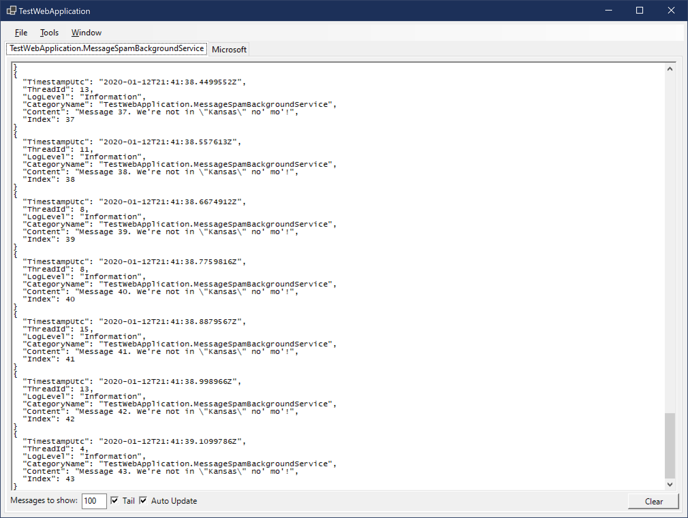

# Macross Software Debugging

[](https://www.nuget.org/packages/Macross.Windows.Debugging/)

[Macross.Windows.Debugging](https://www.nuget.org/packages/Macross.Windows.Debugging/) is a .NET Core 3.1+ library which will spawn a WinForms UI when debugging on Windows to present [ILogger](https://docs.microsoft.com/en-us/dotnet/api/microsoft.extensions.logging.ilogger) messages as they are written by the application in a more friendly way than what the default VS debug console will do. No external tools necessary.

Example:



## Features

* Auto-start when debugger is attached or through [IConfiguration](https://docs.microsoft.com/en-us/dotnet/api/microsoft.extensions.configuration.iconfiguration).
* Displays messages in tabs by category or group.
* Tabs can be hidden.
* Messages, associated data, and scopes are flattened into JSON.
* Automatic tailing of messages.
* Start as window or minimized. 
* Minimize to taskbar or system tray.
* Window and tabs are fully customizable.
* ...and more!

## Performance Goals

* Given this is a debug tool, it should have no impact on production execution. A lot of effort was put into making sure the hooks are not put into the logging pipeline unless the UI is being used.
* The UI should remain responsive even when high-volume messages are being written.
* The UI shouldn't dominate the resources available to the process.

## Usage

Getting the `DebugWindow` integrated into your application is incredibly simple, just add a call to `ConfigureDebugWindow` in your bootstrap:

```csharp
internal class Program
{
	public static void Main(string[] args) => CreateHostBuilder(args).Build().Run();

	public static IHostBuilder CreateHostBuilder(string[] args)
	{
		return Host
			.CreateDefaultBuilder(args)
			.ConfigureWebHostDefaults(webBuilder => webBuilder.UseStartup<Startup>())
			.ConfigureDebugWindow();
	}
}
```

## Visual Studio Launch Settings

When you start debugging a web application Visual Studio will attach to an IIS Express process by default. In that scenario the `DebugWindow` won't spawn until a request comes through the web server and the process is actually spun up. You will get a much better experience if you launch your code directly using the compiled `EXE`. The recommended approach is to switch the default order in `.\Properties\launchSettings.json`:

```json
	...
	"profiles": {
		"WebApplication1": {
			"commandName": "Project",
			"launchBrowser": false,
			"launchUrl": "weatherforecast",
			"applicationUrl": "https://localhost:5001;http://localhost:5000",
			"environmentVariables": {
				"ASPNETCORE_ENVIRONMENT": "Development"
			}
		},
		"IIS Express": {
			"commandName": "IISExpress",
			"launchBrowser": true,
			"environmentVariables": {
				"ASPNETCORE_ENVIRONMENT": "Development"
			}
		}
	}
	...
```

## Configuration

There are different ways to configure the [DebugWindowLoggerOptions](./Code/DebugWindowLoggerOptions.cs) object.

* At runtime:

  The `ConfigureDebugWindow` method accepts a few callbacks that can be used for configuration at runtime:

	```csharp
	.ConfigureDebugWindow(
		options => options.WindowTitle = "My Application DebugWindow Title",
		(window) => window.BackColor = Color.Red,
		(tab) => tab.BackColor = Color.Blue);
	```

  The first callback allows direct configuration of the `DebugWindowLoggerOptions` object. It exposes basic options and things likely to be configured.

  The second and third callbacks allow direct manipulation of the `DebugWindow` and any `DebugWindowTabPage` controls as they are created. Use these for advanced configuration of the UI such as adding controls.

* Via `IConfiguration` pipeline (AppSettings, Command-line, Environment Variables, etc.):

  The `DebugWindowLoggerOptions` object will bind to the `DebugWindow` logging configuration section:

	```json
	{
		"Logging": {
			"DebugWindow": {
				"ShowDebugWindow": true,
				"MinimizeToSystemTray": true,
				"LogLevel": {
					"Default": "Debug",
					"Microsoft": "Warning",
					"Microsoft.Hosting.Lifetime": "Information"
				}
			}
		}
	}
	```

  Most properties tie directly to the options object. `LogLevel` is special and controls which messages in the logging pipeline will be mapped to the `ILogger` passing messages to the UI. See: [Logging in .NET Core and ASP.NET Core](https://docs.microsoft.com/en-us/aspnet/core/fundamentals/logging/#configuration)

  You can also impact these settings via the command-line:

	```powershell
	Start-Process `
		-FilePath "TestWebApplication.exe" `
		-WorkingDirectory "C:\WorkingDirectory\" `
		-ArgumentList "--environment Development --Logging:DebugWindow:ShowDebugWindow=true"
	```

* Groups:

  Log messages in .NET Core are written into categories. Typically the category is the [Namespace].[ClassName] which can lead to a lot of tabs being opened to display messages. To make things more useful, messages can be grouped together.

  * Config-based Grouping
  
	The `GroupOptions` sub-section can be used to define groups by filters. The defaults look like this:

	```json
		{
			"Logging": {
				"DebugWindow": {
					"GroupOptions": [
						{
							"GroupName": "System",
							"CategoryNameFilters": ["System*"]
						},
						{
							"GroupName": "Microsoft",
							"CategoryNameFilters": ["Microsoft*"]
						}
					]
				}
			}
		}
	```

	Note: You should use wildcards when defining filters.

  * Code-based Grouping

	When coding you can define groups dynamically. This is where the debug tool starts to become more powerful because you can group related messages across objects together easily.

	```csharp
	using IDisposable Group = _Logger.BeginGroup("Business Logic Area");

	_Logger.LogInformation("Starting logical process.");

	await ExecuteProcess().ConfigureAwait(false);

	_Logger.LogInformation("Logical process complete.");
	```

	In the above example everything that happens under the "Group" scope will be grouped together.

	BeginGroup is a helper extension over `ILogger.BeginScope`. This is the same thing:

	```csharp
	using IDisposable Scope = _Logger.BeginScope(new LoggerGroup("Business Logic Area"));

	_Logger.LogInformation("Starting logical process.");

	await ExecuteProcess().ConfigureAwait(false);

	_Logger.LogInformation("Logical process complete.");
	```

## Grouping messages by Controller...

The `TestWebApplication` has example middleware you can use to group messages by Controller which is a really useful feature when debugging services.

See: [ControllerNameLoggerGroupMiddleware.cs](./Test/TestWebApplication/ControllerNameLoggerGroupMiddleware.cs)

```csharp
public void Configure(IApplicationBuilder app, IWebHostEnvironment env)
{
	...
	app.UseRouting(); // <- Order is important!
	app.UseMiddleware<ControllerNameLoggerGroupMiddleware>();
	...
}

public class ControllerNameLoggerGroupMiddleware
{
	private readonly ILogger<ControllerNameLoggerGroupMiddleware> _Logger;
	private readonly RequestDelegate _Next;

	public ControllerNameLoggerGroupMiddleware(ILogger<ControllerNameLoggerGroupMiddleware> logger, RequestDelegate next)
	{
		_Logger = logger ?? throw new ArgumentNullException(nameof(logger));
		_Next = next ?? throw new ArgumentNullException(nameof(next));
	}

	public async Task InvokeAsync(HttpContext context)
	{
		RouteValueDictionary? RouteValues = context?.Request.RouteValues;

		IDisposable? Group = null;
		if (RouteValues != null && RouteValues.TryGetValue("controller", out object ControllerName))
			Group = _Logger.BeginGroup(ControllerName.ToString());

		try
		{
			await _Next(context).ConfigureAwait(false);
		}
		finally
		{
			Group?.Dispose();
		}
	}
}
```

Note: It is important that `UseRouting` be executed before this middleware otherwise routing information won't be available.

## How it works...

* An [IHostedService](https://docs.microsoft.com/en-us/dotnet/api/microsoft.extensions.hosting.ihostedservice) is registered into the Appication's [IHostBuilder](https://docs.microsoft.com/en-us/dotnet/api/microsoft.extensions.hosting.ihostbuilder) which manages a low-priority Thread hosting the UI.
* An [ILoggerProvider](https://docs.microsoft.com/en-us/dotnet/api/microsoft.extensions.logging.iloggerprovider) is registered with the .NET Core logging platform for passing messages to the UI.

## Writing the flattened message JSON structure to actual log files...

Some users will find the flattened message JSON format displayed in the UI conveniant and will ask to write it out into actual log files, that is coming soon. Structures are already available in the [Macross.Logging.Abstractions](../Macross.Logging.Abstractions/README.md) library.